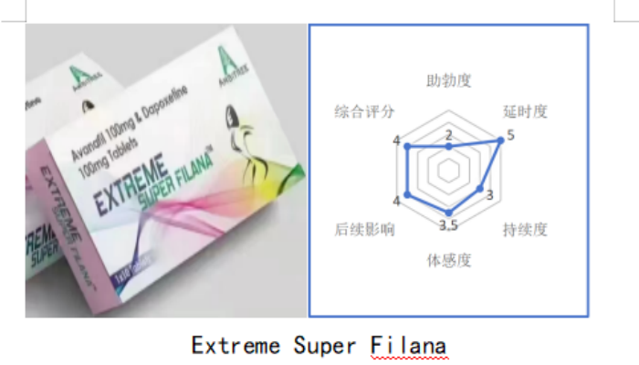
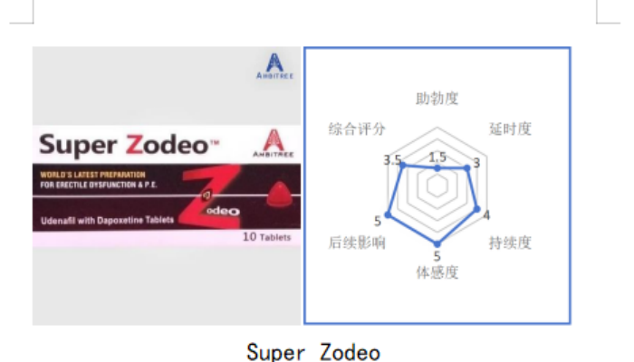

# -

NGA史上最全合剂测评 肉身试药新篇章
转自NGA论坛 id：无欢之宴 https://bbs.nga.cn/read.php?tid=39384205

对于近期营销号断章取义言论的澄清
============

NGA账号：无欢之宴  
抖音账号：无欢之宴  
B站账号：无欢之宴_bili  
近期网络上很多营销号，断章取义，对本人进行污蔑诽谤，本人在此澄清。  
本人早期因使用过印度药物，出于测评分享的心态，编写了相关药物的使用心得与测评。  
但因个人法律意识淡薄，未曾想过测评的药物属于法律严禁售卖的药物，并引起了大量转发传阅，造成的不良影响深感抱歉。本人也从未在任何平台售卖此类药物，测评撰写两年间有多人冒充本人进行诈骗，各位粉丝不要上当，本人不会售卖此类药物。  
希望各位粉丝能够正确对待该类药物，切勿盲目跟风购买和使用印度药物。本人以后也会专心于国产药物测评。  
大家不要被蹭流量营销号带偏节奏，要做守法好公民。  

写在前面的碎碎念
============
首先感谢支持我的小伙伴，这几个月收到了很多支持，所以我打算用更严谨的文本重新编辑帖子，同时加入大量国产仿制药的测评，尽可能在同样的情况下进行对比测试，因为国产仿制药有大量的代工和贴牌情况，所以会优先更新销量好和上市集团的产品。后续的更新进度会比较缓慢但绝不会鸽，赛博神农起源于NGA，吃水也不能忘了挖井人。
同时我也收到很多质疑，接下来会对这些问题进行解答。

试药的初衷？
============
神农最初的时候，从小学就接触diy，然后为了追求快感和担心被发现的心理，越撸越狠，越来越快，以至于实战变成了1、2、3，之后便走上了治疗之路，走过了很多歪路，最后通过合剂和实战治疗，恢复了正常状态。虽然现在只把合剂当做情趣用品，但是依然有很多人在这条路上。所以我想尽自己的一份力，让大家少走一些弯路。

神农现在不用药的水平？
============
现在不用药的话能达到首发6-10分钟。

听说神农不用药硬不起来？
============
这个就是完完全全的谣言了，我不知道为何会有这种说法，可能也只是乐子人骗赞发出来的言论，也有可能是有些人为了落井下石等着看我笑话。至于这些谣言，我只能说：“我每天起床的小帐篷，都比你死后尸僵还要硬吧”

练腿不就行了？吃药多伤身体啊。
============
但凡学过生物课都说不出来这句话，肌肉强大就可以改变神经传输的话，那罗尼库尔曼应该是世界上房事最厉害的人吧？射精的反射通路来源于脊髓反射中心，诚然身体素质重要，但肉体强度无法改变神经、脊髓、大脑。所以两者并不发生关系，也可以一同锻炼。
补充：锻炼是为了让你有更好的体能来应战，单纯锻炼不会提升时间。

正文前的一些免责声明
============

本文中所有产品使用感仅代表个人体感，不作为用药参考，不进行任何推广  
所有产品均为本人自费购买，公平公正，不存在踩一捧一行为  

在网上已经出现很多引流和假冒我的人，希望大家仔细甄别  
对于此类产品的任何问题，还有治疗的相关问题  
都可以进行咨询，我会对所有问题进行解答  
关于更改个别药物分值的说明以及评分标准说明：  
因为早期对部分药物分数测评比较谨慎导致分数较低，为了能够让每个药物的分数更加准确，对部分药物分值进行更改，药物实际分数以字面分值为准(六维图懒得改了，直接在后面用+/-来修改数值)  
所有药物的评分标准，只按照同类进行横向对比和个人心中分值进行评分(单效对比单效，双效对比双效)  

本文首发NGA玩家社区，后续会在B站进行简易更新  

-------------------------------------------------------------------------------------------------------------------------------------------------------------------------------------------------------------------------------
正文

使用前先对常见副作用进行科普：  
助勃类：头痛、潮红、鼻塞、鼻咽炎、肌肉痛、血压降低、肠胃刺激。  
延时类：视线模糊、潮红、头晕、嗜睡、耳鸣、肠胃刺激。  
具体副作用请参考说明书。  
药效学相互作用：可能会降低立位耐力(安静站立的耐受时间)、直立性低血压，所以并不推荐两者联用。  
后续帖子中学名简称：  
**西地那非=Sild **
**他达拉非=Tada **
**伐地那非=Vard **
**阿伐那非=Avan **
**达泊西汀=Dapo **

**各个指标的评分标准： **
(0分为无效果，5分满分)  
**助勃度**：：硬度的个人体感评价，分数越高，硬度越强。  
0分为无效果  
1分为或有或无的提升  
2分为小幅度提升  
3分为常态提升硬度  
4分为努力提肛能达到的硬度  
5分为肉体无法锻炼到的硬度。  
**延时度**：：如果产品中含有延时成分，会根据个人体感进行评价，但是每次boss战并不代表都能在指定时间结束，影响时间的因素也有很多(比如近期作战频率，身体状态，甚至是吃的东西都会有影响)。  
0分为无明显效果  
1分为有提升但不明显  
2分为少量提升  
3分为正常提升  
4分为完全可以自控决定战斗时间  
5分可以理解为战斗中完全不用控制，各种高强度作战也不会结束战斗，甚至需要刻意给武器施加意念buff来缩短武器作战时间才能结束战斗(加速爆冲，全程提肛，脑子里只想着爆发，才能勉强爆发结束战斗)  
**持续度**：：药品完全代谢的时间和个人体感，分数越高，药物持续时间越长，代谢时间越久。如果存在两种成分则按最长的时间计算。  
**体感度**：：副作用的个人体感评价，分数越高，副作用越小。仅代表使用时副作用体感。  
0分为无法进行boss战级别的副作用  
1分为影响较大的副作用  
2分为明显副作用  
3分为说明书提到的常见副作用但影响较小  
4分为一些无关痛痒的副作用  
5分为无副作用  
根据个人体质，体质越好，副作用影响越小  
**后续影响**：：药物完全代谢后的个人体感，分数越高，体感越好。  
0分为非常不适  
1分为影响正常生活的副作用  
2分为明显副作用  
3分为较为明显副作用并感觉到不适但能接受  
4分为有一些无关痛痒的副作用  
5分为完全无事。  
**综合评分**：按照个人体感进行评分，带有个人主观色彩，分数越高，个人评价越高，个人越喜欢使用。但并不代表这个药品适合用于个体治疗，请根据医嘱进行使用和治疗。  
(贴主为猛药派，喜欢使用猛药当做情趣用品，所以药效猛的综合评分会偏高，已经治疗好了原先的枣泄问题。)  
药物吸收在个体表现上不完全相同  
六项评分仅作为参考  

------------------------------------------------------------------------------------------------------------------------------------------------------------------------------------------------------------------------------

**西地那非系列**   
 
成分：Sild 50mg  
个人评价：当时这个药神农是一边玩电脑一边吃着等药效，但是助勃不是很明显，后续就是自己diy结束了战斗，有轻微头晕和视线模糊，潮红的情况，至于硬度提升为什么不高，可能和我个体吸收有关系吧，大多数人反应硬度提升挺明显。易出现潮红和身体发烫，轻微头晕  
助勃度：2.5  
延时度：0  
持续度：3  
体感度：3  
后续影响：3  
综合评分：2.5  
 
成分：Sild 100mg+Dapo 100mg  
个人评价：Ether的产品，增大了药量后，最明显的就是心脏泵感加强，有点像用了氮泵的感觉，硬度提升多了点，但对我来说还是正常范围的提升，同样的其他体感副作用也大了一些。易出现潮红和身体发烫。  
助勃度：4  
延时度：3  
持续度：3  
体感度：3  
后续影响：2.5  
综合评分：3  
 
成分：Sild 100mg+Dapo 100mg  
个人评价：Ambitree的产品，虽然在成分上和上一款不分伯仲，但是意外的体感要好一些，只能说是细节上更胜一筹，硬度提升明显，总体来说没什么大雷点，除了心脏泵感严重，轻微头晕和潮红之外，都属于可以接受的范围内。易出现潮红和身体发烫。  
助勃度：3.5  
延时度：3.5+0.5  
持续度：3  
体感度：3.5  
后续影响：3  
综合评分：3.5  

 
成分：Sild 100mg  
个人评价：虽然名字叫果冻但实际上就是液体，很难吃，香精味特别浓，吃完嘴里还是苦的，喝水冲都不管用。除了吸收快一点点，就没有其他优点了。易出现潮红和身体发烫。  
助勃度：3  
延时度：0  
持续度：2.5  
体感度：2.5  
后续影响：2.5  
综合评分：2.5  

 
成分：Sild 50mg  
个人评价：齐鲁制药有限公司的产品，可以说是西地那非国产仿制药最便宜的存在之一，但是没想到效果意外的顶，从价格和效果来看，很能打，有面色潮红的情况，同时后续非常容易犯困。在前两次能感受到明显助勃，第三次开始后效果会下降不少。这个价位和效果，知足了。(隔壁某金姓产品能不能学点？价格比人贵，效果没人好)  
助勃度：3.5-0.5  
延时度：0  
持续度：3  
体感度：3  
后续影响：3  
综合评分：3.5  

 
成分：Sild 50mg  
个人评价：四川科伦药业的产品，制作的西地那非口崩片，效果出乎意料的好，硬度在线，使用时面色轻微潮红，心脏泵感低，最重要的是事后身体不适感很低，结合它的价格和效果，现在这款产品就是我心中的西地那非T0级别，唯一缺点是不建议口中含服，口感为酸苦的味道，建议直接吞服。  
助勃度：3+0.5  
延时度：0  
持续度：3  
体感度：4  
后续影响：4  
综合评分：5-0.5  

 
成分：Sild 50mg
个人评价：向每一位研发成员致以最真挚的敬意，虽然没有如愿达到原计划的效果，但带来的“副作用”造福了全世界，副作用相比较来说小很多，会出现脸红发烫拉肚子的情况，钱包厚的话无脑推荐  
助勃度：3.5-0.5  
延时度：0  
持续度：3  
体感度：4.5  
后续影响：4.5  
综合评分：5  

 
成分：Sild 100mg+Dapo 100mg  
个人评价：sunrise的产品，sunrise低端产品虽然便宜副作用大，这款高成本的产品效果却十分不俗，硬度和延时统统拉满，完全不介意副作用的话可以尝试一下，它的副作用也是集合了两种成分的“优点”，五官周围易潮红发烫较为严重，头晕和视线模糊略微严重，代谢后肌肉酸痛感较强，易嗜睡乏力。  
助勃度：5  
延时度：5-0.5  
持续度：3  
体感度：2.5  
后续影响：2.5  
综合评分：5-0.5  

------------------------------------------------------------------------------------------------------------------------------------------------------------------------------------------------------------------------------

**他达拉非系列**   
 
成分：Tada 40mg+Dapo 60mg 
个人评价：之前的帖子里没有来得及修改，这里重新讲一下这款，这款产品至少有10年以上的历史，加上一直没什么变化，成本极低且假货很多，是很多药贩子最爱推荐的产品。虽然效果是有，但是副作用对比同类产品确实大很多，所以谨慎购买。 
助勃度：2.5 
延时度：3 
持续度：5 
体感度：2 
后续影响：2.5 
综合评分：2 

 
成分：Tada 20mg+Dapo 100mg 
个人评价：Ambitree的产品，加大了延时成分，减少了助勃成分，虽然延时成分多了，但是也更容易软了，这个还是要看个人身体能否接受，达泊西汀带来的牛牛疲软效果是不可避免的。更容易头晕犯困，潮红发烫的情况相对好一些。 
助勃度：2.5 
延时度：4+0.5 
持续度：5 
体感度：3 
后续影响：3 
综合评分：3 

 
成分：Tada 40mg+Dapo 100mg 
个人评价：Ether的产品有一个明显的效果，就是助勃类成分效果比其他家强，但延时比同类产品效果弱一些，当然这只是个人体感。他达拉非是相对温和长效的产品，所以推荐周末使用，但是达泊西汀的终末半衰期是17h左右，比他达拉非要早很多，所以想第二天再战的老哥们要注意延时效果。他达拉非的助勃效果，偏向石化的感觉，而不是泵血的感觉。头晕潮红相对比西地那非小一些，使用期间易犯困，容易产生华莱士喷射 
助勃度：3.5 
延时度：5 
持续度：3 
体感度：3 
后续影响：3 
综合评分：3 
 

 
成分：Tada 40mg+Dapo 100mg 
个人评价：Ambitree的产品，副作用相对更低，延时效果更好，但是有刺激肠胃更明显的效果，可能会去厕所华莱士喷射一下，之后就会恢复正常了，成分吸收更好的代价，可以把这个当做开战信号。头晕潮红相对比西地那非小一些，使用期间易犯困。 
助勃度：3 
延时度：4+0.5 
持续度：5 
体感度：3 
后续影响：3 
综合评分：3 

------------------------------------------------------------------------------------------------------------------------------------------------------------------------------------------------------------------------------

**伐地那非系列**   
 
成分：Vard 40mg+Dapo 60mg 
个人评价：Ambitree的产品，伐地那非红温效果明显，和运动后的红温相近，伐地那非助勃效果可以说是四种最强了，超越了常规硬度，甚至比提肛的硬度还要高，同样副作用也是比其他类型更加明显。头晕潮红明显，易出现视线模糊，华莱士喷射。 
助勃度：4.5 
延时度：4 
持续度：3.5 
体感度：2.5 
后续影响：3 
综合评分：4 
 

 
成分：Vard 40mg+Dapo 100mg 
个人评价：Ether的产品，个人感觉硬度是同类型里最突破天际，但延时做的相对一般，易出现华莱士喷射。头晕潮红明显，易出现视线模糊。使用完后易嗜睡，身体较为乏力。 
助勃度：5 
延时度：4-0.5 
持续度：3.5 
体感度：2 
后续影响：2.5 
综合评分：4 

 
成分：Vard 40mg+Dapo 100mg
个人评价：Ambitree的产品，保证硬度的同时，时间方面可以做到完全随心所欲，同时副作用相比同类型小一些，易出现华莱士喷射。头晕潮红明显，易出现视线模糊。使用完后易嗜睡，身体较为乏力。
用你的身体好好感受这股超越极限的力量吧，去打败那深不可测的对手吧 
 
助勃度：4.5 
延时度：5-0.5 
持续度：3.5 
体感度：2.5 
后续影响：2.5 
综合评分：5 

 
成分：Vard 10mg 
个人评价：四川科伦药业的产品，国产唯一一家生产伐地那非仿制药的公司，本次测试为30mg，50分钟后出现鼻塞脸红发烫，眼睛有轻微红血丝，同时出现了华莱士喷射。使用后易嗜睡，身体较为发力，综合来讲无明显短板。 
助勃度：4+0.5(30mg)/ 3(10mg) 
延时度：0 
持续度：3 
体感度：3 
后续影响：3 
综合评分：3.5 

 
成分：Vard 20mg/10mg 
个人评价：沈阳红旗制药有限公司的产品，打破了国产伐地那非仿制药只有四川科伦一家的环境，，整体副作用较轻，但是运动过程中脸仍旧比较红，其他副作用较轻，唯一的不足就是持续时间较短，但优点在于有两个档位可以选择(好像比科伦便宜点？)。 
助勃度：4(20mg)，3(10mg) 
延时度：0 
持续度：2.5 
体感度：4 
后续影响：4 
综合评分：4 

 
成分：Vard 20mg 
个人评价：Ambitree的产品，单效助勃，这个综合来说除了性价比高之外，挑不出优点，中规中矩的产品，符合伐地那非的特点，硬度好代谢快，就是脸比较红，一盒30粒能吃到有饱腹感(笑死，对于喜欢这个成分的人来说，如果不需要延时，可以入这个。 
助勃度：3.5 
延时度：0 
持续度：3 
体感度：4 
后续影响：4 
综合评分：4 

 
成分：Vard 40mg+Dapo 100mg 
个人评价：印度莲花生物科技旗下的产品，个人感觉硬度是比较比较顶尖的，但实测延时效果更拉跨，但是硬度消退是最慢的，哪怕是出来之后，立棍消退的速度也是最慢的(喜欢我立棍棍势爆发后从四层开始一层一层消退的输出感么？)。易出现华莱士喷射。头晕潮红明显。使用完后易嗜睡，身体较为乏力。 
助勃度：5 
延时度：3 
持续度：3.5 
体感度：2.5 
后续影响：2.5 
综合评分：3.5 

------------------------------------------------------------------------------------------------------------------------------------------------------------------------------------------------------------------------------

**阿伐那非系列**  
 
成分：Avan 100mg+Dapo 60mg 
个人评价：Ambitree的产品，作为第四代助勃成分，真正做到了极低的副作用，丝滑的使用体验，助勃力度虽然不强，但作为快速起效的成分，用于临时救场和纯粹辅助的情况下，挑不出来任何毛病。唯一需要注意的就是延时成分得1小时才能起效，助勃30分钟不到就能感受到。易出现潮红现象。 
助勃度：2 
延时度：3+1 
持续度：3 
体感度：4 
后续影响：4.5 
综合评分：4 

 
成分：Avan 200mg+Dapo 60mg 
个人评价：Ambitree的产品，和上一款产品比较就是多了100mg阿伐那非，加量后硬度得到了提升，但是副作用依然是吊打其他助勃成分。易出现潮红现象 
助勃度：3.5 
延时度：3+1 
持续度：3 
体感度：4 
后续影响：4.5 
综合评分：4.5+0.5 

 
成分：Avan 200mg 
个人评价：海思科制药的产品，和印度产品相比，这款的硬度意外的不错，而且也没有常见的副作用(小到感觉不出来)，起效快硬度好。不过意外的出现了新的副作用，汗如雨下，就是特别容易出汗。参考黑人兄弟某集 
二更：没有触发暴汗debuff，上次暴汗是个人身体问题。 
 
助勃度：3.5 
延时度：0 
持续度：2.5 
体感度：5 
后续影响：5 
综合评分：4.5 

 
个人评价：上海汇伦江苏药业的产品，国内唯二制作阿伐那非的厂家，和海驰相比较的话，感觉副作用和硬度都有所下降，只剩一点脸红发烫的副作用了，用后犯困比较严重，唯一的缺点可能就是贵了，但是贵不是它的问题，是我的问题，它的价格非常稳定，隔壁海驰偶尔还会有捡漏，枭雄是真的雷打不动，名字和价格有那味了。 
成分：Avan 200mg 
助勃度：3.5 
延时度：0 
持续度：2.5 
体感度：5 
后续影响：5 
综合评分：4.5 

 
成分：Avan 100mg+Dapo 10mg
个人评价：Ambitree的产品，Super Filana的延时plus版。额外添加了40mg延时，Ambitree的延时本身就做的很好，现在更是无敌啦，因为加了延时副作用也会大一点点，易出现潮红现象。 
助勃度：2 
延时度：5-0.5 
持续度：3 
体感度：3.5 
后续影响：4 
综合评分：4 

 
成分：Avan 100mg+Dapo 10mg 
个人评价：Ether的产品。也是它家唯一的阿伐那非双效，秉承了一贯的硬度至上观念，硬度依旧比同类产品高一个档，但副作用方面还是保持了阿伐那非的低副作用，但延时依旧做的中规中矩，易出现潮红现象。 
助勃度：2.5 
延时度：4-0.5 
持续度：3 
体感度：3.5 
后续影响：4 
综合评分： 

------------------------------------------------------------------------------------------------------------------------------------------------------------------------------------------------------------------------------

**特别系列**    
 
成分：Uden100mg+dapo60mg 
个人评价：Ambitree的产品，比较特殊的一款产品，是韩国研究的第五代助勃成分，比阿伐那非副作用还要低，但是硬度提升方面也很小，如果阿伐那非都觉得身体不舒服的话，可以考虑尝试一下这个，而且持续时间约为12小时左右，适合提前吃下来应对突发情况。 
助勃度：1.5 
延时度：3+1 
持续度：4 
体感度：5 
后续影响：5 
综合评分：3.5 

 
成分：爱地那非30mg 
个人评价：想来想去还是重新评价一下吧，国产自研号称第六代助勃成分，刨除商业推广来分析它的效果，它的硬度低于西地那非25mg，副作用和50mg西地那非持平，价格比阿伐那非要高。仅代表个人体感。如果你认为我说错了，请按照个人体感按需使用即可. 
助勃度：2 
延时度：0 
持续度：2 
体感度：2.5 
后续影响：2.5 
综合评分：2 

------------------------------------------------------------------------------------------------------------------------------------------------------------------------------------------------------------------------------

**达泊西汀系列**   
 
成分：Dapo 30mg 
个人评价：四川科伦药业的产品，国产达泊西汀主要是四川科伦和江苏联环两家生产，有很多贴牌代工，看准药厂购买即可，应该不会有剂量和纯度上的区别(待验证)。副作用相对较低，心态容易风平浪静，是达泊西汀的通病。单买达泊西汀的话也更推荐国产货，价格不会有特别大的差别，同时也图个放心。达泊西汀有个通病，就是第一发效果可能不明显，是正常情况 
助勃度：0 
延时度：3.5 
持续度：4 
体感度：3.5 
后续影响：4 
综合评分：3.5 

 
成分：Dapo 30mg 
个人评价：江苏联环药业的代工产品，使用后感觉没有任何副作用，不过用完后， 神农在实战中居然不想透了，一边思考人生一边蠕动。效果上来都伯仲之间，总不能每次神农都是同样身体状态、同样吸收、同一个摩擦力度，然后再掐表计算时间吧？？？这种对照试验但凡对面多夹一下，岂不是就影响测试结果了？人果然是最难控制的变量。 
这就是传说中的贤者模式吧。(二更：现在这个产品换代工了，效果没有之前的好，谨慎购买) 
 
助勃度：0 
延时度：3.5 
持续度：4 
体感度：3.5 
后续影响：4 
综合评分：3.5 

 
成分：Dapo 60mg 
个人评价：Ambitree的产品，单效延时，在几年前作为单效产品从效果和性价比来讲都没什么问题.奈何国产单效也越来越卷，所以就没什么推荐的必要了，毕竟国产仿制药会把纯度和杂质做的更好。相信兔子国的实力。 

助勃度：0 
延时度：3.5-0.5 
持续度：4 
体感度：3 
后续影响：3 
综合评分：3 

 
成分：Dapo 30mg 
个人评价：江苏联环药业的自家产品，通过和爱九进行对比，可以看出药板是一个生产线出来的，效果完全一样，通过查阅，杰士邦的达泊西汀(金盒)药板也是同一生产线。官网仅剩金盒的产品介绍 
黑色盒杰士邦达泊西汀为四川科伦药业生产，银色盒为天方药业生产，好家伙你这是纯贴牌啊？？？吓 
助勃度：0 
延时度：3.5-0.5 
持续度：4 
体感度：3 
后续影响：3 
综合评分：3.5 

 
成分：Dapo 60mg 
个人评价：天方药业和深圳信立泰药业生产的产品，市场上很多延时产品都是出自这两家，秉承着力大砖飞劲不够就加量的态度，是国内唯一一个60mg达泊西汀的牌子，时间上也有更明显的提升，当然副作用也会有所提升，单粒装应该也算是优点，价格方面也可以接受，挑不出来太大问题。 
助勃度：0 
延时度：4.5-0.5 
持续度：4 
体感度：3 
后续影响：3.5 
综合评分：3.5 

 
成分：Dapo 30mg 
个人评价：厦门力卓药业的产品， 18年炒股买了修正药业让我至今站在山顶上，还我血汗钱(不是？？) 。说实话效果有点一言难尽，连神农的贤者状态debuff都没打出来，只能说是有效果，但不多。所以也没感觉到有啥副作用。(二更：后来神农把剩下的送给别的老哥用了，反馈说效果很好，所以我的评测也只代表个人体感，个人之间确实存在效果差异) 
助勃度：0 
延时度：2.5 
持续度：4 
体感度：4 
后续影响：4.5 
综合评分：2.5 

 
成分：Dapo 60mg 
个人评价：盖天力医药控股集团制药股份有限公司，更正一下之前只有一家做60mg达泊西汀的言论，虽然也是60mg达泊西汀，但是时间上的提升不是特别让人满意，当不过价格方面好像比英特要便宜点，也算是可以接受的。 
助勃度：0 
延时度：3.5 
持续度：4 
体感度：3 
后续影响：3.5 
综合评分：3.5 

 
成分：Dapo 60mg 
个人评价：广州泰恩康药业的产品，达泊西汀以后就按几个标准来评价(心态破大防/有贤者模式的感觉/心态波动/心态毫无波动)。这一款就属于心态毫无波动，所以，感觉也没啥用，鉴于线上线下铺货量很大所以才买来试试看，但是在我这里评价只能是一般。 
助勃度：0 
延时度：2.5 
持续度：4 
体感度：4 
后续影响：4.5 
综合评分：2.5 

 
成分：Dapo 30mg 
个人评价：原研药，钱包厚无脑冲，有明显的延时体感却没有贤者debuff，从各方面角度来说都是第一选择，贵不是他的问题。副作用个体感觉接近为0。 
助勃度：0 
延时度：4.5 
持续度：4 
体感度：4.5+0.5 
后续影响：4.5 
综合评分：5 

 
成分：Dapo 30mg 
个人评价：海南卓力制药有限公司的产品，效果惊为天人，本次服用时仅半个小时就发挥了效果，而且时间延长非常明显，副作用也不明显。评4.5分只是为了给原研药留有一席之地，(此工厂还给功夫硬汉做了代工，是同一个生产线生产的，效果相同)。 
助勃度：0 
延时度：4 
持续度：4 
体感度：4 
后续影响：4.5 
综合评分：4.5 

-------------------------------------------------------------------------------------------------------------------------------------------------------------------------------------------------------------------------------

